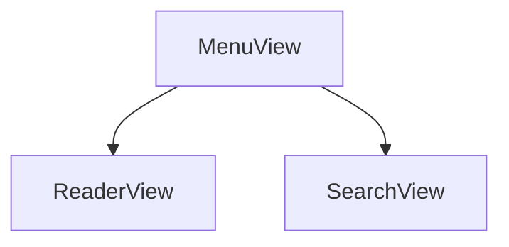
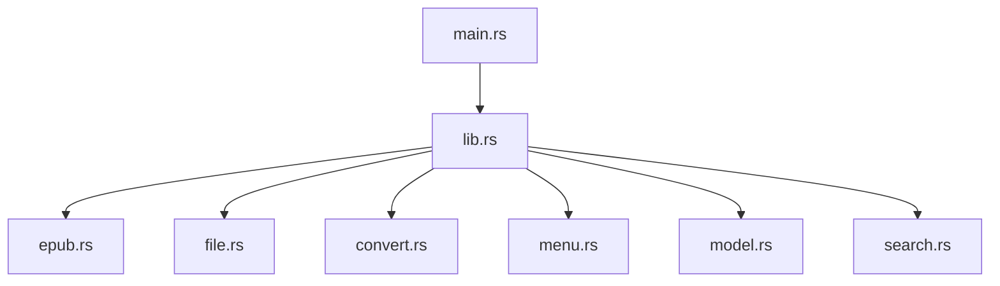

## 如何运行

首先，你需要有以下环境：

1. node & pnpm

2. rust

3. tauri

### 运行

在根目录下运行以下命令：

```bash
# 安装依赖
pnpm install
```

```bash
# 运行
pnpm run tauri dev
```

```bash
# 打包
pnpm run tauri build
```

## 需要做的

### Vue

- [x] 排版改进

- [ ] header美化

- [x] 添加控制按钮

- [ ] 目录页跳转功能

- [x] 多文件上传

- [x] 主页书库页面

### Rust

- [x] 加载默认文件夹下的epub文件

- [x] 保存epub文件

- [ ] 标记位置(书签) -- 返回html时可以返回一个json对象，包含书签位置

- [x] 多个文件同时上传

- [ ] 搜索功能：[网站1](https://digilibraries.com/) 和 [网站2](https://www.gutenberg.org/) 的epub文件

## 介绍

本项目是一个基于Tauri的epub阅读器，使用Vue3作为前端框架，Rust作为后端语言。它的目标是提供一个轻量级、快速、跨平台的epub阅读体验。
本项目的主要功能包括：

- 支持多文件上传
- 支持epub文件的加载和保存
- 支持epub格式电子书的阅读


## 技术栈

- 前端：Vue3 + Vite + TypeScript
- 后端：Rust + Tauri

### 前端说明

前端结构图：



- `MenuView`：菜单视图
  1. `Upload`: 上传文件
  2. `Search`: 搜索文件(未实现)
- `ReaderView`：阅读器视图
  1. `Content`: 书籍内容
  2. `Next` 和 `Prev`: 上一页 和 下一页 翻页按钮
- `SearchView`：搜索视图（未实现）
  1. `Search`: 搜索框
  2. `Result`: 搜索结果列表
  3. `Download`: 下载按钮

#### 上传文件

使用`@tauri/api/plugin-dialog`插件实现文件上传功能。使用`open`方法打开文件选择对话框，选择epub文件后，将文件路径传递给后端进行处理。
使用`@tauri/api/core`实现与后端的通信。使用`invoke`方法调用后端的`get_epub_to_html_files_command`函数，传递文件路径参数。后端处理完成后，将下载与解析后的html文件路径返回给前端。前端进行处理后，在`ReaderView`中显示书籍内容。

#### 书籍内容

将html文件内容渲染到`ReaderView`中。经过观察，基本内容都被封在`<p>`和`<h>`标签中。使用`iframe`标签加载html文件后，但是最难的部分是分页的问题，如何才能保证元素能完整显示而不会被遮挡呢？最终做法是使用一个容器来塞入元素，然后和页面的高度进行比较，是否需要进行分页处理。
对于图片的处理，则是将图片进行等比例缩小，保证图片不会超出页面的范围。使用`max-width: 100%`和`max-height: 100%`来限制图片的大小。

### 后端说明

后端结构图：



- `main.rs`：主函数
- `lib.rs`：Tauri的入口文件，定义了Tauri的命令和事件
- `epub.rs`：epub文件的处理
- `file.rs`：文件的处理
- `convert.rs`：epub文件的转换
- `menu.rs`：菜单的处理
- `model.rs`：数据模型
- `search.rs`：搜索的处理（未实现）

后期需要进行重构，使用`mod.rs`来进行模块划分。

#### epub文件的处理

`epub`
`md5`
`reqwest`
`zip`
`serde`

#### 文件保存和加载
